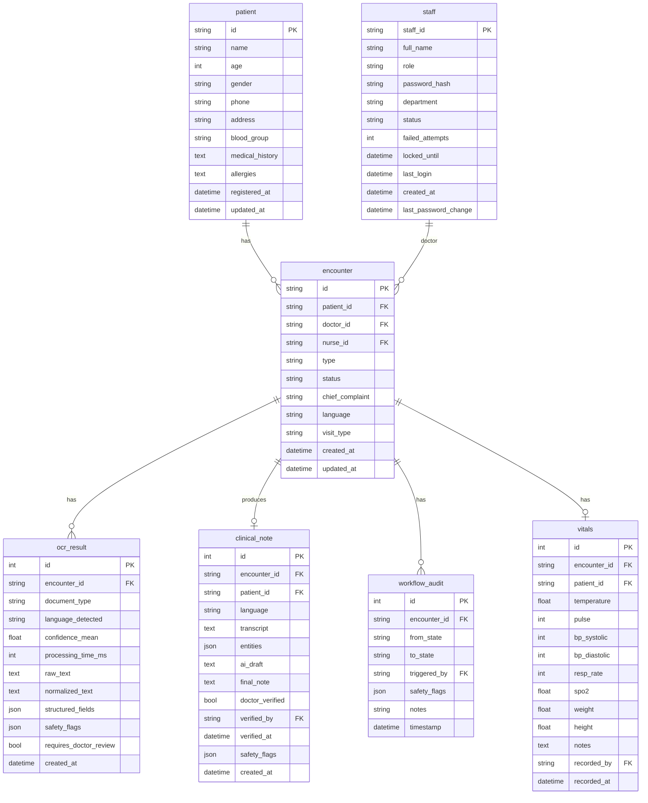

# EHR Database Design — Implementation Plan

Replace all in-memory mock data and localStorage with a proper **SQLite + SQLAlchemy** database. This gives you a real persistent database with zero external dependencies (no need to install PostgreSQL/MySQL), while being easily swappable to PostgreSQL later.

## Current State Analysis

**Everything is ephemeral right now:**

| Data | Where it lives | Problem |
|---|---|---|
| Patients | `_PATIENT_REGISTRY` (Python list) | Lost on server restart |
| Encounters | `_ENCOUNTERS` (Python list) | Lost on server restart |
| Staff/Auth | `_staff_db` (Python dict) | Mock data, lost on restart |
| Workflows | `_WORKFLOW_REGISTRY` (Python dict) | Lost on restart |
| OCR Results | Only in API responses | Never persisted |
| Clinical Notes | Only in workflow [_data](file:///d:/EHR_AI_CODE/core/workflow.py#123-126) dict | Lost on restart |
| Queue/Dashboard | Merged from API + `localStorage` | Fragile, inconsistent |

## Proposed Database Schema

---

## Proposed Changes

### Database Layer (NEW)

New `db/` package at the project root to keep database code isolated from business logic.

#### [NEW] [database.py](file:///d:/EHR_AI_CODE/db/database.py)
- SQLAlchemy engine setup with SQLite (`sqlite:///data/ehr.db`)
- `SessionLocal` factory and `Base` declarative class
- `get_db()` dependency for FastAPI endpoints
- `init_db()` to create tables + seed default staff accounts

#### [NEW] [models.py](file:///d:/EHR_AI_CODE/db/models.py)
- SQLAlchemy ORM models for all 7 tables: [Staff](file:///d:/EHR_AI_CODE/api/middleware/auth.py#67-76), [Patient](file:///d:/EHR_AI_CODE/FE/src/api/nurse.js#82-97), [Encounter](file:///d:/EHR_AI_CODE/FE/src/api/nurse.js#118-137), [OCRResult](file:///d:/EHR_AI_CODE/api/models/responses.py#13-55), [ClinicalNote](file:///d:/EHR_AI_CODE/models/clinical_note.py#11-22), [WorkflowAudit](file:///d:/EHR_AI_CODE/core/workflow.py#65-73), `Vitals`
- Relationships between models (e.g., `Patient.encounters`, `Encounter.ocr_results`)

#### [NEW] [crud.py](file:///d:/EHR_AI_CODE/db/crud.py)
- CRUD functions for each model (`create_patient`, [get_patient](file:///d:/EHR_AI_CODE/api/routes/nurse_station.py#76-82), [search_patients](file:///d:/EHR_AI_CODE/api/routes/nurse_station.py#233-252), [create_encounter](file:///d:/EHR_AI_CODE/api/routes/nurse_station.py#155-216), etc.)
- Used by API routes instead of in-memory lists

#### [NEW] [seed.py](file:///d:/EHR_AI_CODE/db/seed.py)
- Seed data for initial staff accounts (nurse_001, dr_anand, admin_001)
- Seed the 8 mock patients currently in `_PATIENT_REGISTRY`

---

### API Integration

#### [MODIFY] [main.py](file:///d:/EHR_AI_CODE/api/main.py)
- Call `init_db()` at app startup to create tables
- Add `get_db` dependency availability

#### [MODIFY] [nurse_station.py](file:///d:/EHR_AI_CODE/api/routes/nurse_station.py)
- Remove `_MOCK_ENCOUNTERS`, `_ENCOUNTERS`, `_PATIENT_REGISTRY` lists
- Replace with SQLAlchemy queries via `crud.py`
- All endpoints (`dashboard-stats`, `queue-stats`, [encounters](file:///d:/EHR_AI_CODE/api/routes/nurse_station.py#144-153), `patients/search`, `patients/register`) use DB

#### [MODIFY] [doctor_consult.py](file:///d:/EHR_AI_CODE/api/routes/doctor_consult.py)
- Replace `from api.routes.nurse_station import _ENCOUNTERS` with DB query
- [get_upcoming_patients](file:///d:/EHR_AI_CODE/api/routes/doctor_consult.py#37-86) reads from DB instead of shared in-memory list

#### [MODIFY] [auth.py](file:///d:/EHR_AI_CODE/api/middleware/auth.py)
- Replace `_staff_db` dict with DB queries for staff lookup
- `AuthService.login()`, [get_staff_profile()](file:///d:/EHR_AI_CODE/api/middleware/auth.py#727-744), [change_password()](file:///d:/EHR_AI_CODE/api/middleware/auth.py#883-920) use DB

#### [MODIFY] [dependencies.py](file:///d:/EHR_AI_CODE/api/dependencies.py)
- Replace `mock_staff_roles` dict in [verify_staff_role](file:///d:/EHR_AI_CODE/api/dependencies.py#33-55) with DB query
- `_WORKFLOW_REGISTRY` can remain in-memory for now (workflow state is transient per session)

---

### Configuration

#### [MODIFY] [.env](file:///d:/EHR_AI_CODE/.env)
- Add `DATABASE_URL=sqlite:///data/ehr.db`

#### [NEW] [requirements.txt update](file:///d:/EHR_AI_CODE/requirements.txt)
- Add `sqlalchemy`, `aiosqlite` (async SQLite support)

---

## User Review Required

> [!IMPORTANT]
> **Database choice: SQLite vs PostgreSQL**
> This plan uses **SQLite** for simplicity — zero setup, runs everywhere, portable file-based DB. For a production deployment with multiple concurrent users, PostgreSQL would be better. SQLAlchemy makes switching trivial later. Is SQLite acceptable for now?

> [!WARNING]
> **First-time data seeding**: On first run, the DB will be seeded with mock staff and patient data. Existing localStorage data on the frontend won't auto-migrate — the frontend `localStorage` merge logic will be removed in favor of the real DB.

## Verification Plan

### Automated Tests
1. **Database model tests** — Run `pytest tests/` to verify models can be created, queried, and relationships work
2. **API integration tests** — Test that `/api/nurse/dashboard-stats`, `/api/nurse/queue-stats`, `/api/nurse/encounters` (POST), and `/api/doctor/upcoming-patients` return correct data from DB

### Manual Verification
1. **Start the server** with `uvicorn api.main:app --host 0.0.0.0 --port 8000 --reload` — verify tables are created in `data/ehr.db`
2. **Login flow** — Login as `nurse_001` / `Nurse@2024!` and verify it works from DB
3. **Create an encounter** via the patient queue page → verify it persists after server restart
4. **Restart the server** → verify all data (patients, encounters) is still there (the key thing missing today)
5. **Doctor dashboard** → verify upcoming patients show encounters created by nurse
